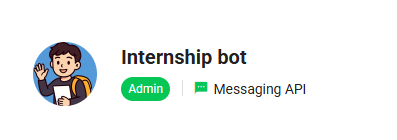
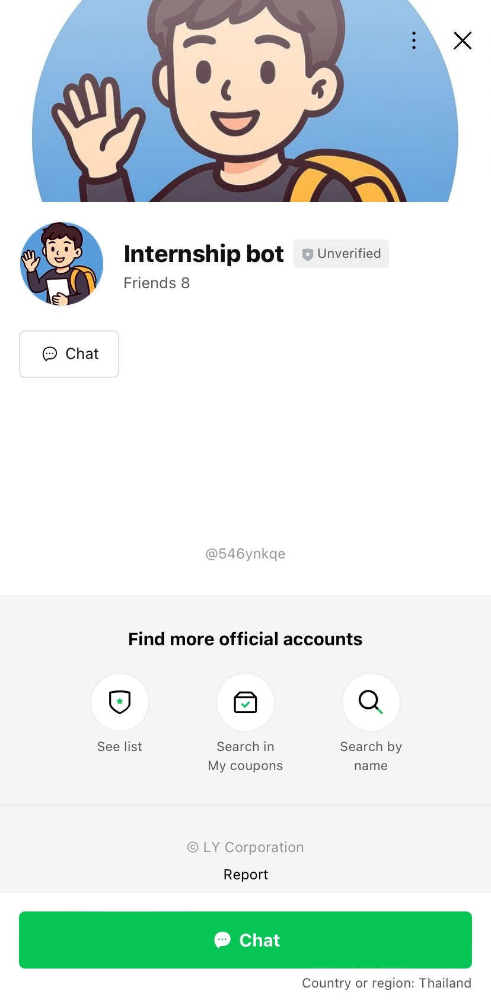
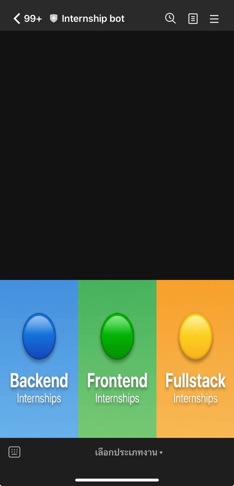
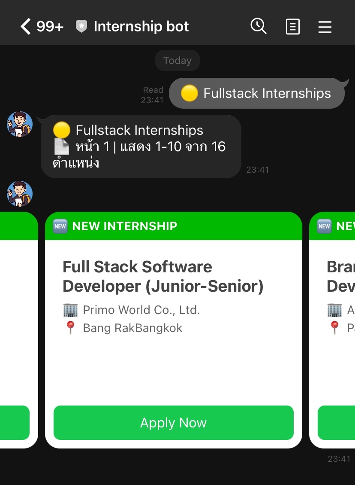
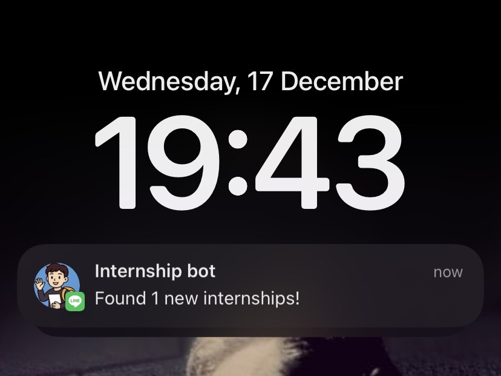
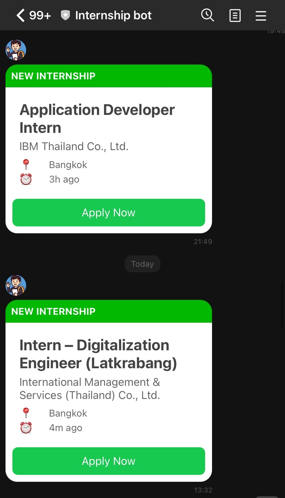
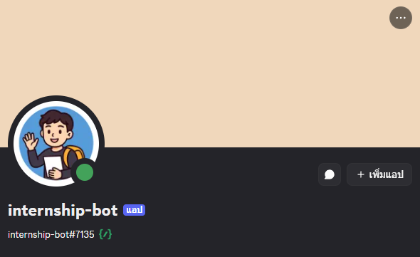
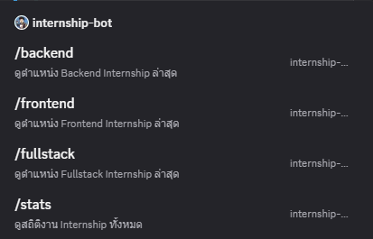

# Internship Alert Bot

## Important
This project is for educational and personal use, focusing on backend system design, automation, and bot integration.
The scraper only extracts publicly available job metadata and does not bypass authentication or paid features.

Internship Alert Bot is an automated job alert system that monitors internship openings from JobsDB.
It supports Backend, Frontend, and Fullstack internship categories with intelligent duplicate detection.
The system delivers real-time notifications via LINE (Rich Menu & Flex Messages) and Discord (Slash Commands & Embeds).
A Go-based web scraper handles HTML parsing, retry logic, and error recovery.
GitHub Actions automate scheduled scraping every 30 minutes without manual operation.
The project focuses on reliability, clean architecture, and scalable bot-based user experience.

## Screenshots

#### 1. Bot Profile

#### 2. Add Bot via QR Code

#### 3. First Time Setup

#### 4. Rich Menu Interface

#### 5. Category Selection

#### 6. New Job Alert (Single)

#### 7. Multiple Job Alerts

#### 8. Discord Bot

#### 9. Bot Command

#### 10. Result List Jobs

